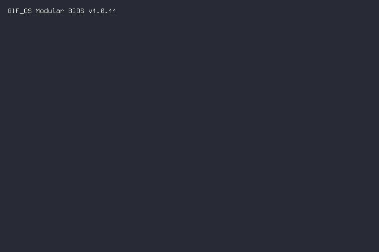

<div align="center">
  <picture>
    <source media="(prefers-color-scheme: dark)" srcset="./output.gif">
    <source media="(prefers-color-scheme: light)" srcset="./output.gif">
    
  </picture>
</div>

<br>

<div align="center">
  <code>offensive security tooling · pentesting platforms · automation</code>
</div>

<br>

building **[HackTool](https://hacktool.io)** — desktop pentesting app. 51 scanning modules, AI agent orchestration, DRM, the works. sole architect.

primary author of **Huntr** — Go-based vuln scanner. session resumption, checkpoint system, TUI dashboard. 122 of 164 commits.

**[DuelSec](https://github.com/DuelSec)** — 1v1 adversarial purple team training. Go + Svelte + Terraform.

```
2,300+ contributions · 409K+ lines · 44 repos · 12 languages · 14 months
```

<br>

<div align="center">
  
</div>

<br>

<picture>
  <source media="(prefers-color-scheme: dark)" srcset="./profile-3d-contrib/profile-night-green.svg" />
  <source media="(prefers-color-scheme: light)" srcset="./profile-3d-contrib/profile-green-animate.svg" />
  
</picture>
