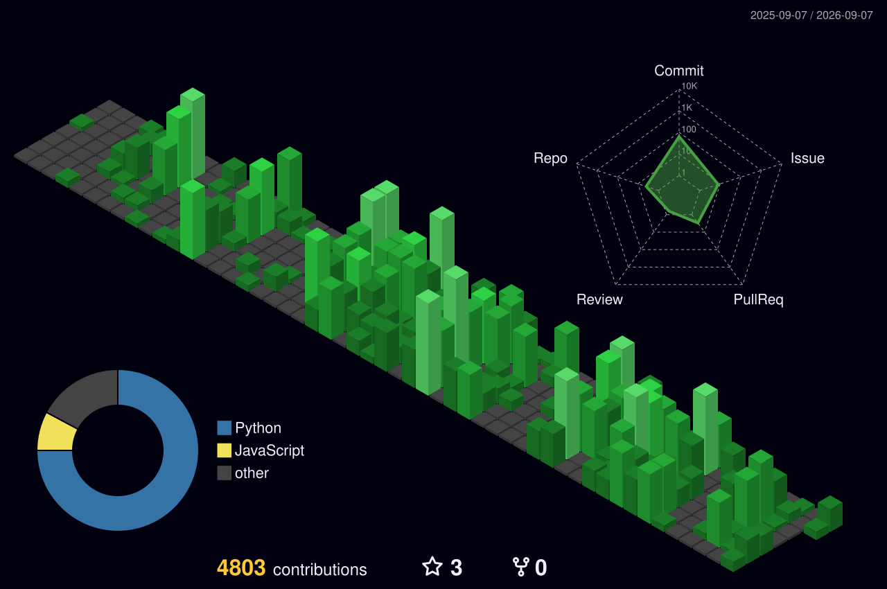

<pre>
⢼⣿⢿⣿⣿⣿⣿⣿⡇⣼⣿⡛⣯⣟⣿⣻⢯⡟⣿⣻⡞⣿⢻⣟⡿⣟⣿⣻⢿⣿⣿⣿⣿⣿⣿⣿⣿⣿⣿⣿⣿⣿⣿⣿⣿⣿⣿⣿⣿⣿⣿⣿⣿⣿⣳⣿⢿⣟⡿⣟⢯⣟⠾⣵⢲⡞⡹⢧⢮⣇⠽⣻⣿⣿⣿⣿⡿⣿⣿⣿⣇⠀⣼⣿⣿⣿⣿⢻⣌⠣⢠⠰⠠⠐⠠⠐⡤⢃⠤⢐⡀⠎⡅⠂⡄⢮⡐⠰⢠⠐⠤⠂⠄⡀⠂⠔⠠⢀⠄⡐
⢺⣿⢿⣿⢾⡿⣿⣿⠇⣼⣷⢻⡵⢺⢶⣻⢮⣟⡾⣷⣏⡾⢷⣾⣽⢯⣾⣿⠿⣾⣿⡿⣧⣿⣿⢿⣿⣟⣿⣿⣿⣿⣿⣿⣿⣿⣿⣿⣿⣿⣿⣿⣿⡟⠻⠞⠿⢿⣷⣯⣳⢮⣛⠷⣞⠺⡵⣛⣶⠼⣹⡿⣿⣿⣿⡿⣽⣯⣽⡳⣿⠜⣿⣯⣿⣿⣧⡟⣤⣛⢦⢒⠡⢀⣁⠲⢄⠦⡖⢦⡐⠳⢌⡉⠄⢢⡹⢀⠣⡘⠠⠙⡄⠄⡉⢀⠂⠄⠂⠐
⢸⡷⡌⢾⣯⣿⣿⢾⡋⣿⡜⣷⡘⢧⡳⣌⠶⣩⣶⢳⣜⣬⡷⣼⢭⣛⡶⣭⡿⣝⣯⣟⣷⣿⣿⣿⡿⢿⣿⣿⣿⣿⣿⣿⣿⣿⣿⣿⣿⣿⣿⣿⣿⣿⣿⣿⣶⣶⣤⣬⣉⡙⠛⠻⣽⣳⣛⣴⢫⢞⠳⣼⢿⣬⡕⣧⠧⣏⢷⣩⢧⠻⣟⡼⣿⣿⣮⣙⣤⠳⣌⢎⠆⡂⠤⠓⣨⢒⡭⢂⠔⠢⢆⠡⢌⢡⠙⣆⠐⣁⠃⡅⡘⠠⠐⡀⠈⢄⠁⠌
⢸⣷⣏⢻⣯⣽⣿⡿⠀⢸⣟⢧⡝⣎⠳⣜⡻⣷⢏⡻⣼⢎⣳⢛⡿⣹⡟⣽⣳⢿⡾⠟⣛⣩⣵⣿⣶⣿⣿⣿⣿⣿⣿⣿⣿⣿⣿⣿⣿⣿⣿⣿⣿⣿⣿⣿⣿⣿⣿⣿⡻⣯⣵⣶⣤⣉⠓⢾⣟⢮⣛⣞⢯⣷⡽⣧⠿⣽⣳⢏⣞⣳⡜⣿⣟⣿⡯⡽⣌⠷⣊⠾⢬⣑⢠⠓⣇⢹⡰⢉⢠⠓⡌⡑⠂⢮⡜⡰⢆⠠⣃⠤⡁⠃⠆⠠⢁⠌⠂⡜
⢸⡮⣟⠷⣿⣿⣿⡷⠰⣿⣿⡴⢿⡽⣏⡷⣽⢣⠿⣳⢮⡹⣝⢮⣝⣧⣻⡝⢋⣡⣴⣿⣿⣿⣿⣿⣿⣿⣿⣿⣿⣿⣿⣿⣿⣿⣿⣿⣿⣿⣿⣿⣿⣿⣿⣿⣿⣿⣿⣿⣿⣮⡹⢿⣿⣿⣿⣶⣌⠛⢾⣚⢧⢯⣽⣭⣟⣽⣿⡼⣎⢧⡟⣮⣟⣯⣱⣹⢬⠳⡱⢎⢣⣟⠰⢸⠬⣥⠘⣌⠠⡓⢠⠁⡡⣞⡄⣡⠫⡔⢀⡒⢌⠡⠈⢆⠡⡈⢅⠸
⢸⢯⡝⣻⢿⣿⣿⡇⢸⣿⣭⣿⣷⢿⡿⣜⣫⡽⣛⢭⢳⣛⠼⣞⣧⠞⢁⣴⣿⣿⣿⣿⣿⣿⣿⣿⣿⣿⣿⣿⣿⣿⣿⣿⣿⣿⣿⣿⣿⣿⣿⣿⣿⣿⣿⣿⣿⣿⣿⣿⣿⣿⣿⣶⣝⢿⣿⣿⣿⣿⣦⡙⢿⣻⡼⣷⢾⣭⣽⠶⣎⠿⡽⣭⣟⣜⠧⡜⣣⢏⡱⡏⠼⣏⣶⠡⣚⠦⡝⠤⠡⡜⢤⠃⠴⢣⠚⡆⠥⠚⡀⠖⣈⠄⢃⠌⡐⠰⠈⢒
⢰⠨⠝⠓⣾⠹⣿⠃⢺⣿⣿⣿⣿⣿⣿⣿⡿⣽⢯⣏⢷⣸⢟⡛⢀⣴⣿⣿⣿⣿⣿⣿⣿⣿⣿⣿⣿⣿⣿⣿⣿⣿⣿⣿⣿⣿⣿⣿⣿⣿⣿⣿⣿⣿⣿⣿⣿⣿⣿⣿⣿⣿⣿⣿⣿⣷⣍⠻⣿⣿⣿⣿⣦⡙⢟⡧⣿⣣⣾⣙⢫⣭⡟⣯⡿⣼⢫⢝⡲⢮⡱⢜⠧⣟⣤⠧⡐⢪⠜⡁⠒⡐⢂⡙⡸⠏⠇⡴⢈⠓⡄⠒⡌⡌⠄⢢⠁⠆⠡⣈
⠘⡄⠠⠐⡈⠛⢽⠀⣾⡿⣯⣿⣿⣟⣻⣿⠿⣿⣿⣿⣯⡷⠃⠀⢨⣿⣿⣿⣿⣿⣿⣿⣿⣿⣿⣿⣿⣿⣿⣿⣿⣿⣿⣿⣿⣿⣿⣿⣿⣿⣿⣿⣿⣿⣿⣿⣿⣿⣿⣿⣿⣿⣿⣿⣿⣿⣿⣿⣦⣝⠿⣿⣿⣿⣦⡙⢷⣭⣷⡹⢧⡞⣝⢯⣯⣿⡟⢬⡳⢎⠵⢪⡙⣜⢹⢺⡀⢣⠘⡄⢃⠬⣑⠸⣷⣉⠚⡕⣣⠘⠤⢡⡐⡌⠤⡁⢎⠰⢁⠰
⠘⡀⠄⠁⠀⡁⢊⠀⠺⢿⣹⢷⣿⣾⣭⣟⣿⡿⣿⣿⡿⠁⠰⣧⣷⣿⣿⣿⣿⣿⣿⣿⣿⣿⣿⣿⣿⣿⣿⣿⣿⣿⣿⣿⣿⣿⣿⣿⣿⣿⣿⣿⣿⣿⣿⣿⣿⣿⣿⣿⣿⣿⣿⣿⣿⣿⣿⣿⣿⣿⣷⣬⠙⣿⣿⣿⣄⠛⣶⡛⣧⢻⣌⣿⡽⣼⡛⣯⡝⢮⣙⣧⢙⢦⢫⢧⡕⠌⢣⠜⡁⠂⡄⢳⡶⣥⢃⣼⢣⠊⠘⢆⠰⠌⠂⡜⠢⡑⡀⢎
⢰⠀⠀⠌⠀⠀⠀⠀⡀⡈⢻⣮⡟⣼⣩⢟⣼⣻⣽⣾⠃⠀⢸⣿⣭⣿⣿⣿⣿⣦⣬⣍⣛⠻⠿⣿⣿⣿⣿⣿⣿⣿⣿⣿⣿⣿⣿⣿⣿⣿⣿⣿⣍⢿⣿⣿⣿⣿⣿⣿⣿⣿⣿⣿⣿⣿⣿⣿⣿⢿⣿⣻⢹⡯⣿⣿⣿⣆⠙⡧⢿⡸⣆⢿⣹⢿⣝⠯⣟⣮⢱⣎⣻⢎⡜⣻⣼⠈⢆⡸⣁⠒⠌⢾⣓⠾⣛⡐⢮⡱⣈⠚⠄⢣⠘⡄⢣⠰⡁⢦
⠀⠂⡄⠂⠁⠀⠀⠀⠀⠁⠀⠀⠉⠳⢽⣛⡾⣝⣻⡟⠀⢸⡿⠿⢻⣿⣯⣿⣿⣿⣿⣿⣿⣿⢓⣰⣬⣭⣿⣿⣿⣿⣿⣿⢿⣿⣿⣿⣿⣿⣿⣿⣿⣦⡻⣿⣿⣿⣿⣿⣿⣿⣿⣿⣿⣿⣿⣿⣿⣧⡛⣽⣭⢣⢥⢻⣿⣿⡆⠹⣏⡽⢭⣟⣯⣿⢮⢟⡾⣜⣫⢿⡜⣫⡜⣷⣹⡃⠦⠰⢆⡈⠴⣩⣽⣙⢷⡹⣔⡓⡦⢘⡘⢄⠒⡜⢢⠱⡘⣤
⠈⠄⠀⠅⠂⠉⠀⠀⠀⠀⠀⠀⢀⠀⠘⠙⠿⣭⡽⠇⠀⢰⢠⢀⠾⣟⣿⣿⣽⡿⣿⣟⣿⣿⣿⣟⣿⣿⣿⣿⣿⣿⣿⡟⢫⣞⡹⢯⣿⣿⣿⡀⢿⣿⣷⠘⣿⣿⣿⣿⣿⣿⣿⣿⡟⡻⠿⠿⠿⢷⡳⣜⣸⠣⡾⠄⣿⣿⣿⠀⣽⣭⢳⡾⣽⡷⢿⡾⣼⢣⣏⣞⣸⢧⣙⣎⡻⢅⢢⠑⣂⠰⠠⡗⣞⡰⢮⡹⢶⠡⡗⣆⠱⢎⠰⣉⠆⣛⠰⣘
⢠⡄⠂⠈⠠⠌⠀⠀⠀⠀⠀⠀⠀⠀⠀⠀⠀⠈⢹⠀⠀⠀⠊⡐⠞⣳⠿⣿⣿⣿⢿⣿⣿⣿⣿⣿⣿⣿⣿⣿⣿⣿⣿⣧⠘⠊⡙⠭⢛⢟⡘⢳⡈⢻⣿⣷⡙⢿⣿⣿⣿⣿⣟⠃⠀⡀⠀⠀⠀⠀⠀⠙⣖⠿⢁⣴⣿⣿⣿⡄⢺⣥⡟⣽⢞⣽⣿⣱⣛⡷⣚⢶⣚⣖⠺⣼⡹⡅⢂⡚⢄⢣⢑⣟⣬⣋⢧⢺⡤⠷⡴⢌⢎⡵⢊⡔⡩⢆⠃⢬
⢹⡞⠄⠈⡀⠂⠀⠀⠀⠀⠀⢂⠁⢀⠀⠀⠀⠀⠀⠀⠀⠀⠘⣴⢘⡖⢣⡯⣝⣬⠿⡿⣿⣿⣿⣿⣿⣿⣿⣿⣿⣿⣿⣿⣧⠀⠀⠀⠀⠀⢌⡳⠃⣸⡿⣻⣿⣮⠙⠟⠛⠉⠀⠀⠀⠁⠠⠀⢁⠘⢆⠆⡍⠐⡿⠛⠙⠉⠉⠁⠸⣧⡟⡽⢮⣻⣼⢳⣳⢻⡽⣎⡷⢭⢷⣭⢼⡡⢇⡘⢌⠆⣾⡽⣦⢻⢎⡥⡙⣏⢲⣋⢦⡘⢥⢊⡕⢪⡑⢪
⢨⣀⠀⠐⠀⠀⠀⠀⠀⠀⠠⠁⢀⠀⠀⠀⠀⠀⠀⠀⠀⠀⠀⠣⡍⠐⠀⢹⣿⣜⣶⣡⠀⠀⠸⢿⡿⣿⣿⣿⣿⣿⣿⣿⣻⣧⠄⠀⠀⠀⠈⠙⢠⡿⠓⠋⠁⠀⠀⠀⠀⠀⠀⠀⠀⠀⠐⠀⠀⠌⠊⠈⠀⠀⠀⠀⠀⠀⠀⠀⠀⢷⣛⣿⣏⣿⣾⠿⣭⡳⣝⢾⣹⢏⡾⣜⡧⡇⢒⡌⢢⡘⡼⣅⢏⡼⢣⢞⡡⢍⡶⣌⢳⡱⢎⠣⡌⠱⡄⢣
⢸⣥⢂⠤⠀⡀⠀⠀⡐⢌⡄⠣⠄⢂⠀⠀⠀⠀⠀⠀⠀⠀⠀⠀⠙⠄⠀⠀⠣⣾⣮⣵⣦⣴⣤⢬⣼⡿⣿⣿⣿⣿⣿⣿⣿⣿⡆⠀⣤⠀⠀⣴⡿⢁⠀⠀⠀⠀⠀⠀⠀⠀⠀⠀⠀⠀⠀⠠⢀⡄⠀⢀⣠⠀⠀⠀⠀⠀⠀⠀⠀⠘⢯⡗⣟⢶⣏⣿⢳⡽⣎⡷⣹⣎⣳⢭⡞⣥⠂⣌⢡⠦⣹⣬⠫⡔⡧⡎⡽⢢⡱⢍⠞⡱⢎⠣⡍⢧⡱⢩
⢸⣿⠃⠆⢁⡀⠀⠒⡌⠖⡘⢈⡁⠆⡤⠁⣈⠀⡔⠀⠀⠀⠀⠀⠀⠀⠀⣀⠀⠀⠛⠿⠟⡄⠙⡄⠉⠁⠈⠋⠻⣿⣿⣿⣯⠍⠀⣰⠀⠀⣾⡟⣠⡇⠀⠀⠀⠀⠀⠀⠀⠀⠀⠀⠀⠀⠀⠀⢫⣿⣿⣯⣿⣦⡀⠀⠀⠀⠀⠀⠀⠀⢸⣯⣽⣛⣮⢟⡾⡵⣏⣾⣱⠮⡵⣎⡼⢧⡘⠤⣈⠴⣓⢮⢻⡍⣓⣩⣕⣣⢸⣉⢾⠧⣉⠷⣜⢢⠱⣩
⢸⣿⡴⢊⠠⡔⠀⢊⠡⢑⠢⠕⡘⠰⢀⢂⠄⠒⣈⠀⠀⠀⠀⠀⢀⠀⠀⣝⣶⡄⡀⠐⠈⠆⠀⠀⠀⠀⠀⠀⠀⠀⠈⠉⠀⠀⠞⠃⠀⠀⣿⣿⣿⣿⡆⠀⠀⠀⠀⠀⠀⠀⠀⠀⠀⠀⠀⢸⣿⣿⣿⣿⣿⣿⠿⠷⠀⠀⠀⠀⠀⠀⣰⢷⡾⣽⡞⣯⢳⡯⣽⢶⣹⣾⡱⢿⡼⣷⡘⠢⡙⢦⡝⣮⣵⣞⢣⡏⣆⣩⡒⡜⢋⡗⣓⠎⡜⢆⠳⢨
⢸⣿⣿⠃⢡⡀⠀⠖⡈⢡⢊⢠⠑⠃⣎⢴⣨⢥⠤⢤⡀⠀⠀⠀⠀⢆⠀⠈⢳⣚⣴⡀⠰⡆⠀⣤⣄⠀⠀⠀⠀⠀⠀⠀⠀⠀⠀⠀⠀⠀⣾⣿⣿⣿⣿⣆⠀⠀⠀⠀⠀⠀⠀⠀⠀⣰⠀⣾⣿⣿⣿⢣⡟⠁⠀⠀⠀⠀⠀⠀⡐⢰⡟⣾⣽⣳⡽⣽⢯⣳⢏⣯⠷⣯⢟⡯⢷⡵⢊⠵⣈⢳⡻⢭⣶⡊⢧⣽⢫⢣⠟⡜⢣⡼⣍⡟⡸⢌⡒⢭
⢸⣿⣿⣏⠆⡰⢉⠧⡙⢆⡣⠞⣍⢻⡜⢦⡳⢎⡿⠤⡤⠀⠀⠀⠀⢀⠂⣄⠀⠘⠟⢰⠡⠄⠀⠙⢿⡂⠀⠀⠀⠀⠀⠀⠀⠀⠀⠀⠀⣸⣿⣧⡙⢿⣿⣿⣷⣦⣄⣀⠀⠈⠒⢐⣊⣵⣾⣿⣿⣿⢯⠋⠀⠀⠀⠀⠀⠀⠀⢰⡇⣸⡝⣾⣱⣷⡹⣟⢾⣳⢻⡼⢯⡳⣏⢿⢫⢾⠡⠖⡰⢊⣷⣏⡖⣿⠳⡞⠧⢮⠹⣜⣣⡝⣣⢗⡥⢊⡔⣈
⢸⣿⣿⡟⠤⡑⢊⠦⣉⠦⣙⢎⠹⣦⡙⡶⡹⢦⡛⡵⡙⢤⠀⠀⠀⠀⠀⠀⠀⠀⠀⠀⠀⠀⠀⠀⠀⠈⠀⠀⠀⠀⠁⠘⠆⢓⠺⠍⠀⢰⣿⣿⣿⣶⣶⣬⡛⠛⠛⠉⠙⠛⠛⠻⠿⣿⣿⣿⣿⠿⠃⠀⠀⠀⠀⠀⠠⣾⣿⣾⡇⠸⣏⣽⢺⡵⣏⢟⣮⢳⢧⡞⣭⡳⢭⣞⡹⣎⠅⡓⠌⣻⢷⣮⠷⣍⡻⡔⣩⢦⣳⣯⢶⡩⣍⢏⠶⡁⠆⢠
⢸⣿⡿⢃⠣⡘⢌⠰⢠⠓⣌⠳⡘⢦⡙⡴⣙⠲⣍⠲⣉⠖⣢⠀⠀⠀⠀⢀⠀⠀⠀⠀⠠⠀⠀⠀⠀⠀⠀⠀⠀⠀⠀⠀⠀⠀⠀⠀⠾⣿⣿⣿⣿⣯⣡⣩⠗⢀⠔⠊⢁⡤⠈⢁⣠⣴⣿⣿⠏⠀⠀⠀⠀⠀⠀⠀⠀⠉⠛⠿⠿⠘⣧⢟⣯⢳⣯⢾⣝⣫⢶⡹⢶⡽⢻⡴⣹⣍⠒⡠⠘⣴⡟⣾⢞⣯⢧⢳⡌⢏⣟⣮⢳⡳⣌⠛⡦⢉⠄⢢
⢘⣿⢏⡀⠣⡐⢠⠃⡌⣚⠠⢅⡹⢄⠳⣐⢣⢋⡖⠱⢌⠲⢡⠂⠀⠀⠀⠈⡀⠰⣦⣄⠀⠀⠨⢆⠀⠀⠀⠀⠀⠀⠀⠀⠀⠀⠀⠀⠀⠀⠁⠈⠛⠻⠿⣿⣿⠁⠀⡔⢫⣷⣴⣿⣿⣿⣿⢏⡀⠀⠀⠀⠀⠀⠀⠀⠀⠀⠀⢀⠀⠈⣷⣩⡞⣿⡜⣻⢮⣷⣫⢽⡳⢯⣳⢽⣱⣌⠣⣐⢩⣶⡹⣍⣾⣘⢌⡧⣹⠟⣼⢻⣏⠷⣌⢣⡑⠎⡠⢃
⠈⠤⠃⠄⠡⠐⠄⢣⠐⣄⠋⡤⠱⣈⣃⡜⡡⢎⡜⡡⠂⡏⡌⠧⡀⠀⠀⠀⢂⡀⢭⣱⣯⣥⣀⠈⠀⠀⠀⠀⠀⠀⠀⠀⠀⠀⠀⠀⠀⠀⠀⠀⠀⠀⠀⠀⠀⠀⠀⠙⢿⣿⣿⣿⣿⣿⣿⣿⣧⠀⢀⣦⣤⣀⠀⠀⠀⣠⡴⣿⠆⢈⡷⣬⠟⣧⢿⡝⣾⣞⡽⢾⣽⣳⣽⢾⠵⣮⡑⣌⢲⣧⡽⠞⣶⣙⣎⢶⡹⣎⠷⣎⢿⡹⣌⡣⡙⢀⠳⣘
⢀⠡⠒⠈⠐⠀⠌⡀⠣⢄⢩⢀⠳⣀⠒⣌⣑⠲⡌⠱⡌⢲⠜⣐⠡⡀⠀⠀⠀⠐⢢⣗⣿⣼⣿⡆⠀⠀⠀⠀⠸⠒⠄⠠⢤⠀⠀⠖⣤⡀⠀⠀⠀⠀⠀⠀⠀⠀⠲⢤⣄⣙⢛⣷⣶⣜⢿⣿⣻⣵⣶⣾⣟⠩⠁⠐⠆⠁⠀⠉⠀⡾⣍⡞⢻⡼⣭⣟⣳⣞⣿⢫⢶⡳⣞⢟⡾⣱⣟⠤⡶⢞⣾⢻⠶⣷⣘⡆⣷⢿⣱⣚⡿⡹⣎⠥⠁⢈⡓⢬
⠀⡐⠈⠄⠁⠀⢀⠐⡀⠆⠀⠀⠁⠐⡌⡐⢆⡱⣈⠇⣌⠣⡚⡅⢒⡡⢀⠀⠀⠀⠀⠙⠋⣙⠋⠀⠀⠀⠀⠀⠐⠻⠀⠀⠙⠏⢰⣞⣴⡥⠀⠀⠀⠀⠀⠀⠀⠀⠀⠡⢬⣛⠿⣿⣿⣿⣦⡹⣿⣿⣿⣿⣿⡇⠰⠀⠀⠀⠀⠀⠚⠑⠉⠈⠀⠀⠀⠉⠉⠈⠉⠋⠳⣟⡾⣏⣟⡳⣞⢯⣝⣫⠶⢯⢞⣱⢯⣜⡱⢧⡧⣜⢳⢧⣙⠢⠁⢢⢙⠸
⠀⠄⡁⠀⠀⡀⠠⠀⡐⠀⠄⢃⠘⠀⠰⠁⡒⠤⡁⡜⢠⠓⡘⠴⡡⢈⠥⠒⠤⡀⡀⠀⠀⠀⠀⠀⠀⡀⠀⠀⠀⠸⣿⣆⠰⣲⣾⡇⢻⡇⠀⠀⠀⠀⠀⠀⠀⡀⡄⢻⢸⣿⣿⣶⣿⣿⣿⣿⣼⣿⣿⣿⡄⢿⡟⠁⠀⠀⠀⠀⠀⠀⠀⠀⠀⠀⠀⠀⠀⠀⠀⠀⠀⠉⠀⠉⣾⢱⡻⣞⢬⣛⠼⡳⢎⡏⣇⢏⣹⢋⡾⡜⣊⠶⣩⠃⠐⡠⢊⠴
⠀⠂⠐⠠⠀⠀⠀⠁⠐⡈⠔⠂⢌⠐⢠⠃⠌⢢⠱⡈⢆⠣⣉⠒⡅⢊⠔⡉⢆⠡⡐⠠⠀⢠⠂⢆⠱⡀⠇⠀⠀⠀⠙⣿⣦⠈⣿⣧⡈⣿⠀⠀⠀⠀⠀⠀⠀⠁⠀⠘⠘⠟⠿⠻⡿⠻⠿⠿⢿⣿⢿⣿⣿⢆⣀⠀⠀⠀⠀⠀⠀⠀⠀⠀⠀⠀⠀⠀⠀⠀⠀⠀⠀⠀⠀⣎⡳⣝⡲⠝⣮⢜⡣⢟⣭⡚⣜⢾⠩⣏⠖⡿⢡⣋⠷⠀⢡⠐⢡⢺
⠀⠌⠠⠁⠂⠄⡀⠐⢀⠒⠈⠄⠂⠠⠂⡌⡘⡄⢣⠑⡂⢆⠡⡘⠰⡁⢎⠰⢈⠂⡅⠀⠀⢆⡩⠌⠃⠈⠀⠀⠀⣶⠀⠸⢿⣧⡜⢻⠱⣘⡄⠀⠀⠀⠀⠀⠀⠸⠀⣄⣷⡄⢰⡀⢠⡆⠀⣰⡆⢠⣤⠀⣦⡀⣡⡄⠀⠀⠀⠀⠀⠀⠀⠀⠀⠀⠀⠀⠀⠀⠀⠀⠀⠀⢰⢪⡵⣌⡖⢧⡚⠬⣱⠫⡴⢹⠘⣎⠳⣌⠗⡸⢧⠘⡇⠐⡄⢊⠐⣈
⠀⠠⠁⢀⠡⠀⠐⠠⠀⠘⠠⠘⠀⡁⠆⠠⠁⠜⡠⢃⠱⡈⠆⡡⢃⠜⠠⡘⢠⠑⡀⠀⠐⠂⠀⠀⠀⠀⠀⠀⠀⢿⠀⠘⢦⣙⢿⡍⠧⠹⣿⡄⠀⡀⠀⠀⠀⡴⠀⢀⡛⡀⠹⠁⠿⠃⠀⢿⡟⢸⣿⡆⣿⡆⢸⠀⠀⠀⠀⠀⠀⠀⠀⠀⠀⠀⠀⠀⠀⠀⠀⠀⠀⢰⢋⠾⠁⠊⠈⠀⠀⠁⠁⣛⡰⢃⠇⣌⢣⠬⢞⡡⢏⡜⡄⠡⡐⢀⠂⠀
⠀⠀⠄⠂⠀⠄⠀⠠⠁⡀⠁⠀⠀⠄⠐⡀⠡⠘⢠⠃⣂⠱⡈⠔⢂⠌⠰⣀⠃⠜⠀⠀⠀⠀⠀⠀⡠⠀⢠⠀⠀⠸⣧⢠⣎⠻⣷⠀⣻⡿⣮⣿⣦⣻⣄⠳⣤⣄⣀⡘⠛⠃⠀⠳⠀⢾⠇⠀⡴⠀⠀⠀⠉⠁⠈⠀⢀⡀⠀⠀⠀⠀⠀⠀⠀⠀⠀⠀⠀⠀⠀⠀⠀⠘⠀⠀⠀⠀⠀⠀⠀⣠⠄⢧⡘⢥⣊⡜⢌⡜⠤⣃⠏⡔⠂⠠⢁⠂⡁⠀
⠀⠠⢀⠐⠠⠀⠄⠁⡐⠠⢁⠀⠠⢈⠐⡀⠄⠁⢂⠒⡀⠆⢡⠘⡠⢈⠐⠠⡈⠜⠀⠀⢠⢀⠀⡀⠀⢠⠁⠂⠀⠀⠙⠿⣿⣷⡌⣶⣿⡄⢄⠻⣿⣿⣿⣿⣶⣮⣭⣙⠻⣶⣶⣤⡄⠀⣀⠀⢠⣤⡠⠀⢀⡀⠀⠀⣰⠃⠀⠀⠀⠀⠀⠀⠀⠀⠀⠀⠀⠀⠀⠀⠀⠀⠀⠀⠀⠀⠀⢠⡙⢤⠋⣆⠹⣄⠣⠰⡀⠘⡄⢃⠚⠬⡁⢀⠃⠄⢀⠀
⠀⠀⠂⠈⠀⠐⠈⠐⡀⠁⠠⠀⠀⠂⡐⠠⠐⡀⠄⠊⠄⡑⢂⡑⠰⠀⠌⠄⠡⠌⡀⠀⠰⢈⠰⠈⠁⠀⠀⠀⠀⠀⠀⠀⠀⠙⠻⠹⣷⣿⣦⡉⢻⣿⣿⣿⢿⣿⣿⣿⣿⣦⣙⣛⡀⠁⡿⠍⠉⠁⠀⢀⠋⠉⡀⢀⡗⣣⠀⠀⠀⠀⠀⠀⠀⠀⠀⠀⠀⠀⠀⠀⠁⠀⠀⠀⠀⢀⡘⢤⡉⠦⡩⢄⠣⢤⠙⣂⠱⠀⠘⡠⢋⠤⠁⠀⠌⡀⠂⠀
⠀⠀⠀⠀⠀⠂⠈⠀⠀⠠⠁⠀⢀⠂⠄⠁⠄⡐⠈⠄⠡⡐⢠⠂⡡⠌⢂⠩⡐⠠⠱⠀⠐⡨⠀⠀⠀⠀⠀⠀⠀⠀⠀⠀⠀⠀⠀⠀⠈⠻⠿⡿⣷⣿⣿⣿⣶⣦⡿⡿⢿⡿⢿⣿⣷⣶⣦⣴⣶⣾⡀⠾⠰⠁⢠⢚⠬⡱⢆⡄⠀⠀⠀⠀⠀⠀⠀⠀⠀⠀⠀⠀⠀⠀⠀⠀⠘⢆⡸⠤⡙⡰⠡⢎⢡⢂⠱⠠⣁⠣⠀⠰⡁⠆⠀⢀⠂⠀⠄⠀
⠀⠀⠀⠀⠀⢀⠠⠀⠐⠀⠀⠀⠀⠄⠈⠄⠠⢀⠁⢊⠐⡄⢃⠰⠁⡌⢂⠡⢐⠡⠙⠀⢂⢁⠒⠄⢠⠀⠆⡉⠂⠀⠀⠀⠀⠀⠀⠀⠀⠀⠀⠀⠀⠣⠉⠛⠛⠛⠟⢻⣮⣥⣌⣿⣿⣿⣿⣧⣼⣿⠿⡇⠀⠀⢠⡚⢔⢣⠖⡬⢓⠦⡄⠀⠀⠀⠀⠀⠀⠀⠀⠀⠀⠀⠀⠀⠀⠀⠀⠣⠱⢄⠓⠌⢂⠌⠠⠁⠀⠀⠁⠄⠡⠘⠀⠀⠠⠀⠀⡈
⠀⠀⠁⠈⠀⠀⠀⠀⠀⠀⠀⠀⡐⠈⠀⠂⢁⠠⠈⠄⢂⠰⡀⢃⠥⠐⠂⢌⠂⢂⡍⠀⠌⡐⠌⢌⠂⡅⠂⠀⠐⠀⠀⠀⠀⠀⠀⠀⠀⠀⠀⠀⠀⠀⠀⠀⠀⠐⢾⣿⣿⣿⣿⣿⣿⣿⣿⣿⣿⣿⣧⡁⠠⡀⢰⡙⣊⢦⡹⣐⠋⠊⠈⡀⠀⠀⠀⠀⠀⠀⠀⠀⠀⠀⠀⠀⠀⠀⠀⠀⢀⠬⡘⠈⡄⠈⠄⢀⠂⠀⠂⡈⠄⠡⠀⠀⠠⠀⠀⠐
⠀⠀⠂⢀⠀⠀⠀⠀⠀⠀⠂⢀⠀⠄⠁⡐⠀⠠⠁⠌⡐⢂⠑⠨⢠⠁⠃⠤⠉⠄⡒⠠⠑⡈⠜⡠⠡⢈⠄⡀⠀⠀⠀⠀⠀⠀⠀⠀⠀⠀⠀⠀⠀⠀⠀⠀⠀⠀⠀⠀⠸⠟⠿⢿⣿⣿⣿⠿⠿⢿⠟⣰⣆⠣⠐⠣⢍⠦⡱⢌⠧⠀⢸⠀⠀⠀⠀⠀⠀⠀⠀⠀⠀⠀⠀⠀⠀⠀⠀⣄⣖⣆⠰⠡⠀⠃⠌⠠⠀⠂⠄⠠⠈⢀⠀⠀⠀⠀⠀⠠
⠀⠀⠀⠀⠀⡀⠐⠀⠀⠄⠀⠀⡀⠂⠠⠀⢈⠀⡐⠠⠌⡐⠨⢁⠂⠌⡐⢂⠉⠄⡑⢠⠡⠘⡐⠄⣁⠢⠐⠠⠀⠀⠀⠀⠀⠀⠀⠀⠀⠀⠀⠀⠀⠀⠀⠀⠀⠀⠀⠀⠀⠀⠀⠈⠉⠉⠉⠙⠂⠀⠀⠉⠁⢀⡄⢫⢘⠢⢓⡌⠆⠀⠀⠀⠀⠀⠀⠀⠀⠀⠀⠀⠑⠀⠞⠋⠀⠀⢈⠡⡈⠌⠡⡑⢈⠒⠘⢂⠉⠚⠐⠂⠀⠀⠀⠀⠀⠆⠄⠀
⠀⠀⠀⠈⠀⠀⠀⠀⠀⠀⡀⠄⠀⠄⠐⠀⠂⠀⠄⠐⠠⠀⠅⢂⠁⡂⢐⡀⠃⠌⡐⠠⠂⠡⠐⠈⠀⠂⠁⠀⠀⠀⠀⠀⠀⠀⠀⠀⠀⠀⠀⠀⠀⠀⠀⠀⠀⠀⠀⠀⠀⠀⠀⢠⢃⠲⡐⢢⠒⡔⢢⠒⡌⢆⡸⣀⢣⢑⡊⢬⡉⢦⢀⠀⠄⠀⠀⠀⠀⠀⠀⠀⠀⠀⠀⠀⠀⡄⠢⢑⠨⠘⡀⢁⠂⠌⠐⡀⠂⠁⠠⠀⠂⠁⠀⢀⠀⠀⠀⠀
⠀⠀⠀⠀⠀⠀⠀⠀⢀⠀⠀⠀⠠⠀⠂⠈⠀⠁⠠⠈⠀⠌⠐⡀⢂⠐⠠⢀⠡⠀⣀⡤⠐⠐⠈⠉⠈⠀⠀⠀⠀⠀⠀⠀⠀⠀⠀⠀⠀⠀⠀⠀⠀⠀⠀⠀⠀⠀⠀⠀⠀⠀⠐⡀⢊⠔⣉⠢⡑⢌⡂⠇⡜⢠⢃⠌⡒⡌⡜⢢⡙⠢⣍⡀⠛⡄⠀⢀⠀⠀⠀⠀⡀⢀⠰⣈⠱⢈⠆⡡⢊⠁⠄⡀⠈⠄⡁⠀⠂⠁⢀⠀⠀⠀⠀⠠⠀⠀⠀⠀
⠀⠀⠀⠀⠀⠀⠀⠀⠀⠀⠀⠀⠄⠀⠐⠀⠐⠀⠄⠠⠁⠂⠐⡀⠂⢈⠐⢀⡔⠀⣏⣄⠀⠀⠀⠐⠀⠀⠀⠀⠀⠄⠋⠀⠀⠀⠀⠀⠀⠀⠀⠀⠀⠀⠀⠀⠀⠀⠀⠀⠀⢀⠂⠐⠠⠌⢠⠡⠘⡀⠘⠤⣁⠣⠌⢎⠱⣈⠜⡡⢎⡑⣢⠅⢘⠀⠀⠰⡈⠧⡘⠱⡘⢄⠣⣐⠈⢆⠢⢁⢂⠡⠀⢀⠀⠐⠀⢁⠀⠂⠀⠀⠀⠀⠀⠀⠀⠀⠀⠀
⠀⠀⠀⠀⠀⠀⠀⠀⠀⠀⠀⠀⠀⠀⠀⠂⠀⡀⠀⠄⠐⠀⡁⠀⡐⠀⠀⡾⡇⠀⠟⠁⠀⢀⠀⠀⠀⠀⠀⠀⠀⠀⠀⠀⠀⠀⠀⠀⠀⠀⠀⠀⠀⠀⠀⠀⠀⠀⢀⠠⢄⡀⠊⠄⢡⠈⠄⣂⠡⢌⠡⠒⡄⡃⠎⣌⠒⢥⢊⠕⣊⡱⢡⠊⠀⠀⠀⠰⣁⠒⡡⢃⠜⡠⢅⠂⢩⠐⡈⠆⠂⠄⡁⠀⠀⠀⡀⠀⠀⠀⠀⠀⠀⠀⡀⠀⠀⠀⠀⠀
⠀⠀⠀⠀⠀⠀⠀⠀⠀⠀⠀⠀⠀⠀⠀⠀⠀⠀⠀⠀⡐⠀⠠⠀⠀⠀⠰⣓⠶⡄⠀⠀⠈⠀⠀⠀⠀⠀⠐⠈⠁⠂⠀⠀⠀⠀⠀⠀⠀⠀⠀⠀⠀⠀⣀⣀⣠⢴⡲⢬⡑⠪⠑⣤⠐⢈⠒⠤⢁⠊⡐⡁⢂⠱⠨⠄⡍⠢⠜⡨⠔⣡⢃⠀⠀⠀⠀⡱⢀⠣⡑⢌⠰⠐⡠⠉⢄⠂⠡⠈⠌⠐⠀⡀⠁⠀⠀⠀⠀⠀⠀⠀⠀⠠⠀⠀⠀⠀⠀⠀
⠀⠀⠀⠀⠀⠀⠀⠀⠀⠀⠀⠀⠀⠀⠀⠀⠀⠀⠀⠄⠀⠀⠀⠀⠀⠀⠂⣝⢊⣿⢦⣀⠀⠀⠀⠀⠀⠀⠀⠀⠀⠀⠀⠀⠀⠀⠀⠀⠀⠀⠀⠀⠀⢌⣻⣿⡽⢶⡱⣾⣟⡗⢰⣌⠱⡀⠂⡐⠠⢂⠡⠄⠃⠌⠡⠈⡔⠡⢃⡘⢐⠂⠈⠀⠀⠀⠀⠀⡁⠆⢡⠂⡘⠰⢀⠡⠂⠌⠠⢁⠈⠀⠐⠀⠀⠀⠀⠀⠀⠀⠀⠀⠀⠀⠀⠀⠀⠀⠀⠀
⠀⠀⠀⠀⠀⠀⠀⠀⠀⠀⠀⠀⠀⠀⠀⠀⠀⠀⠀⠀⠀⠀⠀⠀⠀⠀⠘⢌⡖⠚⣾⣻⣿⣦⣄⡀⠀⠀⠀⠀⠀⠀⠀⠀⠀⠀⠀⠀⠀⠀⠀⠀⠠⢶⣹⣿⣘⣶⣹⢿⡟⢰⣿⡛⠳⠘⡄⠠⠁⠂⠐⠈⠐⠈⠀⠡⢀⠡⢀⠰⠈⡀⠀⠀⠀⠀⠀⠀⠐⠈⡀⠐⠠⠁⠀⡐⠈⡀⠄⠀⠠⠈⠀⠀⠀⠀⠀⠀⠀⠀⠀⠀⠀⠀⠀⠀⠀⠀⠀⠀
⠀⠀⠀⠀⠀⠀⠀⠀⠀⠀⠀⠀⠀⠀⠀⠀⠀⠀⠀⠀⠀⠀⠀⠀⠀⠀⠈⢀⡚⡀⠟⡷⣯⣿⣿⣿⣶⣤⣀⠀⠀⠀⠀⠀⠀⠀⠀⠀⠀⠀⠀⠀⠑⠢⢌⡛⠿⣷⣿⠋⡐⣿⣿⠿⢃⣤⢿⠀⠐⠀⠂⠀⠀⠠⠐⠠⠀⠐⡀⠂⠁⠐⠀⠀⠀⠀⠀⠀⠈⠀⠀⠐⠀⠀⠁⠀⠀⠀⠀⠈⠀⠀⠀⠀⠀⠀⠀⠀⠀⠀⠀⠀⠀⠀⠀⠀⠀⠀⠀⠀
⠀⠀⠀⠀⠀⠀⠀⠀⠀⠀⠀⠀⠀⠀⠀⠀⠀⠀⠀⠀⠀⠀⠀⠀⠀⠀⠀⠀⠐⢡⡙⠜⣯⣽⣾⣯⣿⢿⣿⣿⣶⣤⣀⡀⠀⠀⠀⠀⠀⠀⠀⠀⡟⠁⠢⠍⠑⠌⠻⡼⠟⣉⣴⣾⣿⣿⣿⠀⠀⠀⠀⠀⠁⠀⠄⠀⡐⠀⠠⠀⠁⠀⠀⠀⠀⠀⠀⢀⣤⠀⠀⠀⠀⠂⠀⠀⠀⠀⠀⠀⠀⠀⠀⠀⠀⠀⠀⠀⠀⠀⠀⠀⠀⠀⠀⠀⠀⠀⠀⠀
⠀⠀⠀⠀⠀⠀⠀⠀⠀⠀⠀⠀⠀⠀⠀⠀⠀⠀⠀⠀⠀⠀⠀⠀⠀⠀⠀⠀⠀⠀⠎⠳⡴⣙⠻⣷⣻⢿⣿⣿⣿⣿⣿⣿⣿⣷⣦⣤⣤⣀⣉⡐⠈⠃⠀⠖⠀⢂⣤⣶⣿⣿⣿⣿⣿⣿⣿⠂⠀⠀⠂⠀⠀⠀⠀⠀⠀⠀⠀⢀⠈⠀⠀⢠⡀⠀⠀⠀⣈⣇⠀⢚⡂⠀⠀⠀⠀⠀⠀⠀⠀⠀⠀⠀⠀⠀⠀⠀⠀⠀⠀⠀⠀⠀⠀⠀⠀⠀⠀⠀
⠀⠀⠀⠀⠀⠀⠀⠀⠀⠀⠀⠀⠀⠀⠀⠀⠀⠀⠀⠀⠀⠀⠀⠀⠀⠀⠀⠀⠀⠀⠀⠃⣡⢉⡛⡏⡟⢿⡯⣽⣿⣿⣿⣿⣿⣿⣿⣿⣿⣿⣿⣿⣿⣷⣶⣦⡘⢿⣿⣿⣿⣿⣿⣿⣿⣿⣿⡇⠀⠀⠀⠀⠀⠀⠀⠀⠀⠀⠁⢀⣀⠀⣴⠟⠁⠀⠀⠀⣹⣿⠀⠈⣿⡄⠀⠀⠀⠀⠀⠀⠀⠀⠀⠀⠀⠀⠀⠀⠀⠀⠀⠀⠀⠀⠀⠀⠀⠀⠀⠀
⠀⠀⠀⠀⠀⠀⠀⠀⠀⠀⠀⠀⠀⠀⠀⠀⠀⠀⠀⠀⠀⠀⠀⠀⠀⠀⠀⠀⠀⠀⠀⠀⠀⠙⣤⠡⣙⠨⢟⡾⣷⣾⣝⣻⣏⣿⣿⣿⣿⣿⣿⣿⣿⣿⣿⣿⣷⠀⠈⠻⣿⣿⣿⣿⣿⣿⣿⡇⠀⠀⠀⠀⠀⠀⠀⠀⠀⠀⢀⡀⠉⠃⠀⠀⠀⠀⠀⠀⣸⣿⠆⠀⠘⡇⠀⢀⠀⠀⠀⠀⠀⠀⠀⠀⠀⠀⠀⠀⠀⠀⠀⠀⠀⠀⠀⠀⠀⠀⠀⠀
⠀⠀⠀⠀⠀⠀⠀⠀⠀⠀⠀⠀⠀⠀⠀⠀⠀⠀⠀⠀⠀⠀⠀⠀⠀⠀⠀⠀⠀⠀⠀⠀⠀⠀⠀⢣⢱⢊⡖⡰⣭⢏⣿⣿⣿⣿⣿⣿⣿⣿⣿⣿⣿⣿⣿⣿⡟⠀⠀⠀⠈⢿⣿⣿⣿⣿⣿⠃⠀⠀⠀⠀⠀⠀⠀⠀⠀⣠⣿⠏⠁⠀⠀⠀⠀⠀⠀⠠⠿⣿⠆⢀⠀⣿⠀⠀⠣⠄⠀⠀⠀⠀⠀⠀⠀⠀⠀⠀⠀⠀⠀⠀⠀⠀⠀⠀⠀⠀⠀⠀
⠀⠀⠀⠀⠀⠀⠀⠀⠀⠀⠀⠀⠀⠀⠀⠀⠀⠀⠀⠀⠀⠀⠀⠀⠀⠀⠀⠀⠀⠀⠀⠀⠀⠀⠀⠀⠊⡍⡳⠷⢧⣯⣽⣻⡽⣯⢾⣭⣛⠿⣿⣿⣿⣿⣿⣿⠇⠀⠀⠀⠀⠀⢻⣿⣿⣿⡿⠀⠀⠀⠀⠀⠀⠀⢀⡜⣳⠛⠁⠀⠀⠀⠀⠀⠀⠀⠀⠤⠶⣷⡀⠰⠀⡚⠀⠀⠀⠐⠀⠀⠀⠀⠀⠀⠀⠀⠀⠀⠀⠀⠀⠀⠀⠀⠀⠀⠀⠀⠀⠀
⠀⠀⠀⠀⠀⠀⠀⠀⠀⠀⠀⠀⠀⠀⠀⠀⠀⠀⠀⠀⠀⠀⠀⠀⠀⠀⠀⠀⠀⠀⠀⠀⠀⠀⠀⠀⠀⠐⢩⠳⣎⢾⣳⡿⣿⣿⣿⣾⣿⣿⣿⣿⣿⣿⣿⡿⠀⠀⠀⠀⠀⠀⠈⣿⣿⣿⠃⠀⠀⠀⠀⠀⠀⠠⣿⣞⣣⠁⠀⠀⠀⠀⠀⠀⠀⠀⢀⢤⡀⠀⠀⠀⢸⠁⠀⠀⠀⢀⡃⠀⠀⠀⠐⠄⠀⠀⠀⠀⠀⠀⠀⠀⠀⠀⠀⠀⠀⠀⠀⠀
⠀⠀⠀⠀⠀⠀⠀⠀⠀⠀⠀⠀⠀⠀⠀⠀⠀⠀⠀⠀⠀⠀⠀⠀⠀⠀⠀⠀⠀⠀⠀⠀⠀⠀⠀⠀⠀⠀⠀⢋⡍⢫⣙⠿⣯⣿⣿⣿⣿⣿⣿⣿⣿⣿⣿⠃⠀⠀⠀⠀⠀⠀⠀⠸⣿⣿⠁⠀⠀⠀⠀⠀⠀⠉⡘⠻⠁⠀⠀⠀⠀⠀⠀⠀⠀⠀⢠⡀⠿⡀⠀⢤⣤⠀⠀⠀⠀⢠⠃⠀⠀⠀⠀⠀⠈⠀⠀⠀⠀⠀⠀⠀⠀⠀⠀⠀⠀⠀⠀⠀
⠀⠀⠀⠀⠀⠀⠀⠀⠀⠀⠀⠀⠀⠀⠀⠀⠀⠀⠀⠀⠀⠀⠀⠀⠀⠀⠀⠀⠀⠀⠀⠀⠀⠀⠀⠀⠀⠀⠀⠈⠙⢦⣌⣻⣽⣿⣿⣟⣿⣿⣿⣿⣿⣿⡏⠀⠀⠀⠀⠀⠀⠀⠀⠀⣿⣿⣾⠀⠀⠀⠀⠀⠈⠳⡦⠀⠀⠀⠀⠀⠀⠀⠀⠀⠀⣠⡬⢋⠷⠁⣠⠀⠀⠁⠀⠀⣀⠋⠀⠀⠀⠀⠀⠀⠀⠀⠁⠀⠀⠀⠀⠀⠀⠀⠀⠀⠀⠀⠀⠀
⠀⠀⠀⠀⠀⠀⠀⠀⠀⠀⠀⠀⠀⠀⠀⠀⠀⠀⠀⠀⠀⠀⠀⠀⠀⠀⠀⠀⠀⠀⠀⠀⠀⠀⠀⠀⠀⠀⠀⠀⠀⠈⠙⠻⣿⣿⣿⣿⡿⣿⣿⣿⣿⡿⠀⠀⠀⠀⠀⠀⠀⠀⠀⠀⢸⣟⣻⡃⠀⠀⠀⣼⣿⡄⠀⠀⠀⠀⠀⠀⠀⠀⠀⠀⢠⣤⠉⠃⠀⢈⡀⠄⠀⠀⠀⣐⡞⠀⠀⠀⠀⠀⠀⠀⠀⠄⠀⠀⠀⠀⠀⠀⠀⠀⠀⠀⠀⠀⠀⠀
⠀⠀⠀⠀⠀⠀⠀⠀⠀⠀⠀⠀⠀⠀⠀⠀⠀⠀⠀⠀⠀⠀⠀⠀⠀⠀⠀⠀⠀⠀⠀⠀⠀⠀⠀⠀⠀⠀⠀⠀⠀⠀⠘⢧⢀⢉⠛⢿⣿⣿⣏⣿⣿⠃⠀⠀⠀⠀⠀⠀⠀⠀⠀⠀⠈⢿⣿⠃⠀⠀⣰⢿⡟⠀⠀⠀⠀⠀⠀⠀⠀⠀⠀⣰⠟⠃⠀⠀⢠⡞⠁⠀⠂⠀⠀⠛⠀⠀⠀⠀⠀⠀⠀⡀⠀⠀⠀⠀⠀⠀⠀⠀⠀⠀⠀⠀⠀⠀⠀⠀
⠀⠀⠀⠀⠀⠀⠀⠀⠀⠀⠀⠀⠀⠀⠀⠀⠀⠀⠀⠀⠀⠀⠀⠀⠀⠀⠀⠀⠀⠀⠀⠀⠀⠀⠀⠀⠀⠀⠀⠀⠀⠀⠀⠀⠈⣿⣷⣤⣌⡙⠻⢿⠇⠀⡞⠁⠀⠀⠀⠀⠀⠀⠀⠀⠘⣿⣿⡇⠀⠀⠈⡿⠀⠀⠀⠀⠀⠀⠀⠀⠀⣠⠟⠁⠈⠀⠀⣰⣿⠁⠀⠀⠀⣠⡀⠀⠀⠀⠀⠀⢀⡠⠞⠀⠀⠀⠀⠀⠀⠀⠀⠀⠀⠀⠀⠀⠀⠀⠀⠀
⠀⠀⠀⠀⠀⠀⠀⠀⠀⠀⠀⠀⠀⠀⠀⠀⠀⠀⠀⠀⠀⠀⠀⠀⠀⠀⠀⠀⡄⠀⠀⠀⠀⠀⠀⠀⠀⠀⠀⠀⠀⠀⠀⠀⠀⠀⢹⣿⣿⣿⣝⣶⡖⢰⠃⠀⠀⠀⠀⠀⠀⠀⠀⠀⠈⣿⣿⠀⠀⠀⣂⠁⠀⠀⠀⠀⠀⠀⠀⢀⡴⠁⠀⠀⠀⣀⣾⡟⠁⠀⠀⣠⡞⠀⠁⠀⠀⣀⣤⠶⠏⠁⠀⠀⠀⠀⠀⠀⠀⠀⠀⠀⠀⠀⠀⠀⠀⠀⠀⠀
⠀⠀⠀⠀⠀⠀⠀⠀⠀⠀⠀⠀⠀⠀⠀⠀⠀⠀⠀⠀⠀⠀⠀⠀⠀⠀⠀⠀⠉⠀⠀⠀⠀⠀⠀⠀⠀⠀⠀⠀⠀⠀⠀⠀⠀⠀⠀⢉⣛⡿⣿⣿⣿⡿⠁⠀⠀⠀⠀⠀⠀⠀⠀⠀⠀⢹⠏⠀⢀⠄⠢⠀⠀⠀⠀⠀⠀⠠⠔⠋⠀⠀⠀⢀⡴⠋⠀⠀⠀⢀⡞⠃⠀⠀⠀⠀⠟⠎⠁⠀⠀⠀⠀⠀⠀⠀⠀⠀⠀⠀⠀⠀⠀⠀⠀⠀⠀⠀⠀⠀
</pre>

<div align="center">
  <code>offensive security tooling · pentesting platforms · automation</code>
</div>

<br>

i build offensive security tools. most of my work is closed source.

**[ScopeVault](https://github.com/tikket1/ScopeVault)** — local-first bug bounty scope manager. syncs HackerOne + Intigriti into SQLite. search, classify, export.

**[KaliForgeII](https://github.com/tikket1/KaliForgeII)** — kali bootstrapper for pentesters setting up fresh machines.

**[HackTool](https://hacktool.io)** — desktop pentesting platform. 51 scanning modules, AI agents, DRM. sole architect. (closed source)

### security research

26 published CVEs across 19 open source projects, reported through coordinated disclosure.
2 critical, 17 high, 5 medium, 2 low.

<details>
<summary>full list</summary>

<br>

| CVE | project | severity |
|---|---|---|
| [CVE-2026-33734](https://www.cve.org/CVERecord?id=CVE-2026-33734) | [FOSSBilling](https://github.com/FOSSBilling/FOSSBilling) | medium |
| [CVE-2026-34393](https://www.cve.org/CVERecord?id=CVE-2026-34393) | [Weblate](https://github.com/WeblateOrg/weblate) | high |
| [CVE-2026-34455](https://www.cve.org/CVERecord?id=CVE-2026-34455) | [Hi.Events](https://github.com/HiEventsDev/hi.events) | high |
| [CVE-2026-34592](https://www.cve.org/CVERecord?id=CVE-2026-34592) | [Coolify](https://github.com/coollabsio/coolify) | high |
| [CVE-2026-39362](https://www.cve.org/CVERecord?id=CVE-2026-39362) | [InvenTree](https://github.com/inventree/InvenTree) | medium |
| [CVE-2026-42331](https://www.cve.org/CVERecord?id=CVE-2026-42331) | [FOSSBilling](https://github.com/FOSSBilling/FOSSBilling) | high |
| [CVE-2026-44741](https://www.cve.org/CVERecord?id=CVE-2026-44741) | [Pimcore](https://github.com/pimcore/pimcore) | high |
| [CVE-2026-45162](https://www.cve.org/CVERecord?id=CVE-2026-45162) | [Pimcore](https://github.com/pimcore/pimcore) | high |
| [CVE-2026-53757](https://www.cve.org/CVERecord?id=CVE-2026-53757) | [Emlog](https://github.com/emlog/emlog) | critical |
| [CVE-2026-53758](https://www.cve.org/CVERecord?id=CVE-2026-53758) | [Emlog](https://github.com/emlog/emlog) | high |
| [CVE-2026-55224](https://www.cve.org/CVERecord?id=CVE-2026-55224) | [MineAdmin](https://github.com/mineadmin/MineAdmin) | high |
| [CVE-2026-55384](https://www.cve.org/CVERecord?id=CVE-2026-55384) | [InvoiceShelf](https://github.com/InvoiceShelf/InvoiceShelf) | medium |
| [CVE-2026-55386](https://www.cve.org/CVERecord?id=CVE-2026-55386) | [InvoiceShelf](https://github.com/InvoiceShelf/InvoiceShelf) | medium |
| [CVE-2026-55387](https://www.cve.org/CVERecord?id=CVE-2026-55387) | [InvoiceShelf](https://github.com/InvoiceShelf/InvoiceShelf) | medium |
| [CVE-2026-55671](https://www.cve.org/CVERecord?id=CVE-2026-55671) | [Zitadel](https://github.com/zitadel/zitadel) | low |
| [CVE-2026-55762](https://www.cve.org/CVERecord?id=CVE-2026-55762) | [Rocket.Chat](https://github.com/RocketChat/Rocket.Chat) | high |
| [CVE-2026-57209](https://www.cve.org/CVERecord?id=CVE-2026-57209) | [Heimdall](https://github.com/dadrus/heimdall) | high |
| [CVE-2026-59765](https://www.cve.org/CVERecord?id=CVE-2026-59765) | [Gitea](https://github.com/go-gitea/gitea) | high |
| [CVE-2026-61576](https://www.cve.org/CVERecord?id=CVE-2026-61576) | [Lightdash](https://github.com/lightdash/lightdash) | high |
| [CVE-2026-61628](https://www.cve.org/CVERecord?id=CVE-2026-61628) | [nginx-ignition](https://github.com/lucasdillmann/nginx-ignition) | high |
| [CVE-2026-61638](https://www.cve.org/CVERecord?id=CVE-2026-61638) | [Wallos](https://github.com/ellite/Wallos) | high |
| [CVE-2026-61639](https://www.cve.org/CVERecord?id=CVE-2026-61639) | [Wallos](https://github.com/ellite/Wallos) | high |
| [CVE-2026-61640](https://www.cve.org/CVERecord?id=CVE-2026-61640) | [Wallos](https://github.com/ellite/Wallos) | high |
| [CVE-2026-63008](https://www.cve.org/CVERecord?id=CVE-2026-63008) | [Kimai](https://github.com/kimai/kimai) | low |
| [CVE-2026-63769](https://www.cve.org/CVERecord?id=CVE-2026-63769) | [Huginn](https://github.com/huginn/huginn) | high |
| [CVE-2026-72884](https://www.cve.org/CVERecord?id=CVE-2026-72884) | [Dokploy](https://github.com/Dokploy/dokploy) | critical |

</details>

```
hello friends :) o7 o7
```

<br>

<picture>
  <source media="(prefers-color-scheme: dark)" srcset="./profile-3d-contrib/profile-night-green.svg" />
  <source media="(prefers-color-scheme: light)" srcset="./profile-3d-contrib/profile-green-animate.svg" />
  
</picture>
